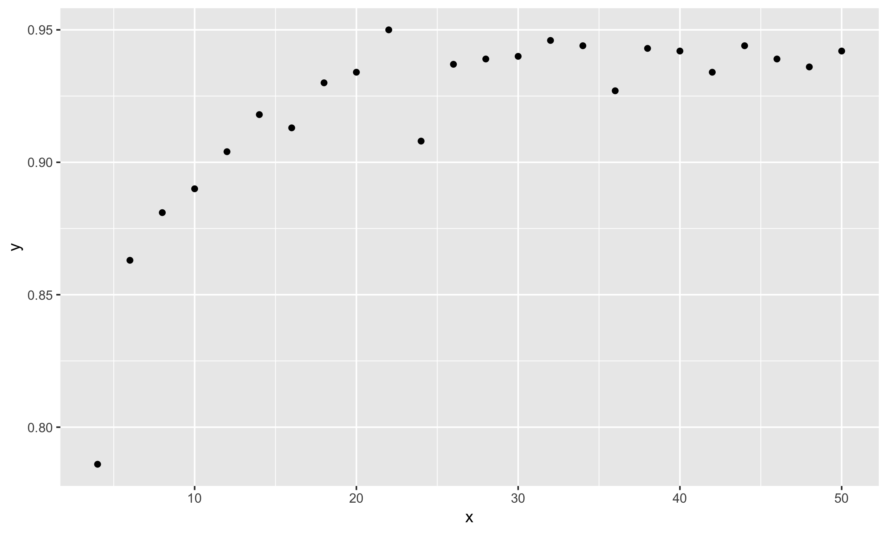

## What is R?

R is a program. Like any program, it takes inputs from a user and does something.

In this case, the input is your code.

You can input code in two ways:

1. R can read it from a file
2. R can read it "interactively"

We'll focus on using R interactively in this module.

---

## Does Something

What do we want R to do? What is the output?

This will determine how you use R (or any other language).

---

## Communication

If you want to communicate something to someone:

* HTML
* PDF Document
* Jupyter Notebook
* Website
* Pretty Pictures

Plus the code to repeat/modify the above material

---

## ETL

If you want to transform data:

* CSV, JSON, RData, SQL, database entries

Plus the code to repeat/modify the transformation

---

## Your Own Opinion

If you want to learn, ask questions, the output might be:

* Nothing

Plus the code to repeat/modify your question or answer.

---

## You're writing code

No matter what you use R for, the code is always an end in and of itself.

---

## R is functional

You can manage code complexity in R with functions.

1. Write functions that have one responsibility.
2. Assign each responsibility fully to one function.

---

## Learning R

Today we want to use R to do the following:

Test the accuracy of the standard errors in an OLS regression, given input data of different sizes, with Gaussian noise.

---

## Break down the problem

The first step is to break down the task into separate responsibilities:

1. Generate input data with Gaussian noise, of differing sizes.
2. Get standard errors of OLS regression on the above input data.
3. Compare OLS estimate to the true value.

---

## Responsibility

Given our breakdown of the tasks in this problem, we know we need 3 functions.

Let's start with the first one, generating data.

---

## Functions in R

Here is a function that generates zeros:

```{R}
generate_data <- function (howMuchData) {
    output <- rep(0, how_much_data)
    return(output)
}
```

How does variable assignment work? Function arguments? Function calls?

---

## Functions in R

Remember the return statement is optional. This is the same:

```{R}
generate_data <- function (how_much_data) {
    output <- rep(0, how_much_data)
    output
}
```

---

## Functions in R

What if we do this? Is this the same function?

```{R}
how_much_data <- 20

generate_data <- function () {
    output <- rep(0, how_much_data)
    output
}
```
---

## Functions in R

If R doesn't find a variable inside the function, it will look outside.


---

## Functions in R

What's bad about this?

```{R}
generate_data <- function () {
    output <- rep(0, how_much_data)
    output
}

how_much_data <- 20
data <- generate_data()

how_much_data <- 35
data_2 <- generate_data()
```


---

## Functions in R

Remember the responsibility metaphor. Previously, the function generate_data was completely in charge of generating data.

In this version, the responsibility of generating the data is shared: between the function and whoever is in charge of keeping track of the value of "how\_much\_data" in the global scope.

---

## Functions in R

That someone is you.

But you shouldn't be sharing the responsiblity. You have enough to do.

Give the responsibility fully to the function. Write a reliable function.

---

## Functions in R

```{R}
generate_data <- function (how_much_data) {
    output <- rep(0, how_much_data)
    output
}


data <- generate_data(20)

data_2 <- generate_data(35)
```

---

## Generating Data

Let's work on generating data according to the data generating process:

$$
    y = \beta x + \epsilon
$$

Where

$$
    x \sim Normal(0, 1)
$$
$$
    \epsilon \sim Normal(0, \sigma^2)
$$

---


## Generating Data

```{R}
generate_data <- function(N, beta, sd) {
    x <- rnorm(N, 0, 1)
    eps <- rnorm(N, 0, sd)
    y <- beta*x + eps
    list(x = x, y = y)
}
```

What are lists in R?

---


## Generating Data

```{R}
generate_data <- function(N, beta, sd) {
    x <- rnorm(N, 0, 1)
    eps <- rnorm(N, 0, sd)
    y <- beta*x + eps
    list(x = x, y = y)
}
```

What is a list?

---


## Running the Regression

```{R}
run_regression <- function(y, x) {
    coef <- ???
    se <- ???
    list(coef=coef, se=se)
}
```

Here again we have two responsibilities:

1. Calculating the coefficient on x.
2. Calculating the standard errors on the coefficients.

---

## Running the Regression

```{R}

calc_coef <- function(y,x) cov(x,y) / var(x)

calc_se <- function(y, x, coef) {
    n <- length(y)
    eps <- y - x*coef
    e_sd <- mean(eps^2)
    se <- sqrt(e_sd / (n*var(x)))
    se
}
```

* Functions can be put on one line!
* var() actually returns the unbiased variance estimate (n-1), but we will just use it to keep things simple.

---

## Running the Regression

```{R}

run_regression <- function(y, x) {
    coef <- calc_coef(y, x)
    se <- calc_se(y, x)
    list(coef=coef, se=se)
}
```

---

## Evaluating the Model

```{R}

eval_model <- function(coef, se, beta, conf = 1.96) {
    up <- coef + se*conf
    down <- coef - se*conf
    beta > down & beta < up
}
```

* Default function values
* Logical operators
* Will this return a scalar or a vector? (depends on coef and beta!)

---

## Evaluating the Model

```{R}

eval_model <- function(coef, se, beta, conf = 1.96) {
    up <- coef + se*conf
    down <- coef - se*conf
    beta > down & beta < up
}
```

Note:

* Default function values
* Logical operators
* Will this return a scalar or a vector?

---

## Making our simulation

```{R}
simulate <- function(N, beta, sd) {
    d <- generate_data(N, beta, sd)
    m <- run_regression(d$y, d$x)
    eval_model(m$coef, m$se, beta)
}

avg_simulations <- function(M, N, beta, sd) {
    inside <- sapply(1:M, function (x) simulate(N, beta, sd))
    sum(inside) / M
}
```

* apply family
* Summing boolean vector


---

## Results

Let's see our results:

```{R}
library(ggplot2)

check_N <- function(M, beta, sd) {
    x <- seq(4, 50, 2)
    y <- sapply(x, function(N) avg_simulations(M, N, beta, sd))
    qplot(x, y)
}
```

---

## Results


